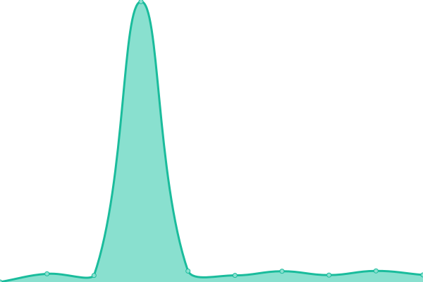
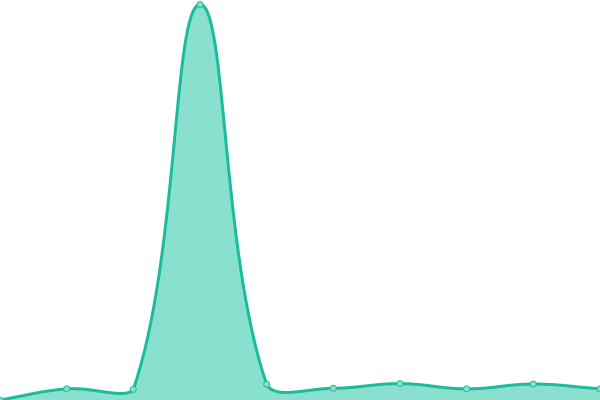

# [📈 Live Status](https://status.pacviewer.com): <!--live status--> **🟩 All systems operational**

This repository contains the open-source uptime monitor and status page for [PacViewer](https://pacviewer.com), powered by [Upptime](https://github.com/upptime/upptime).

With [Upptime](https://upptime.js.org), you can get your own unlimited and free uptime monitor and status page, powered entirely by a GitHub repository. We use [Issues](https://github.com/PacViewer/uptime/issues) as incident reports, [Actions](https://github.com/PacViewer/uptime/actions) as uptime monitors, and [Pages](https://status.pacviewer.com) for the status page.

<!--start: status pages-->
<!-- This summary is generated by Upptime (https://github.com/upptime/upptime) -->
<!-- Do not edit this manually, your changes will be overwritten -->
<!-- prettier-ignore -->
| URL | Status | History | Response Time | Uptime |
| --- | ------ | ------- | ------------- | ------ |
|  [Pacviewer](https://pacviewer.com) | 🟩 Up | [pacviewer.yml](https://github.com/PacViewer/uptime/commits/HEAD/history/pacviewer.yml) | 

 2741ms
     
 | 

<a href="https://status.pacviewer.com/history/pacviewer">99.54%</a>
    

|  [Pacviewer Phoenix](https://phoenix.pacviewer.com) | 🟩 Up | [pacviewer-phoenix.yml](https://github.com/PacViewer/uptime/commits/HEAD/history/pacviewer-phoenix.yml) | 

 4967ms
     
 | 

<a href="https://status.pacviewer.com/history/pacviewer-phoenix">93.53%</a>
    

|  [Pacviewer Beta](https://beta.pacviewer.com) | 🟩 Up | [pacviewer-beta.yml](https://github.com/PacViewer/uptime/commits/HEAD/history/pacviewer-beta.yml) | 

 3790ms
     
 | 

<a href="https://status.pacviewer.com/history/pacviewer-beta">88.52%</a>
    

|  [Pacviewer API](https://api.pacviewer.com/livez) | 🟩 Up | [pacviewer-api.yml](https://github.com/PacViewer/uptime/commits/HEAD/history/pacviewer-api.yml) | 

 441ms
     
 | 

<a href="https://status.pacviewer.com/history/pacviewer-api">99.55%</a>
    

|  [Pacviewer Beta API](https://beta-api.pacviewer.com/livez) | 🟩 Up | [pacviewer-beta-api.yml](https://github.com/PacViewer/uptime/commits/HEAD/history/pacviewer-beta-api.yml) | 

 579ms
     
 | 

<a href="https://status.pacviewer.com/history/pacviewer-beta-api">88.70%</a>
    

<!--end: status pages-->

[**Visit our status website →**](https://status.pacviewer.com)

## 📄 License

- Powered by: [Upptime](https://github.com/upptime/upptime)
- Code: [MIT](./LICENSE) © [Anand Chowdhary](https://anandchowdhary.com), supported by [Pabio](https://pabio.com)
- Data in the `./history` directory: [Open Database License](https://opendatacommons.org/licenses/odbl/1-0/)
